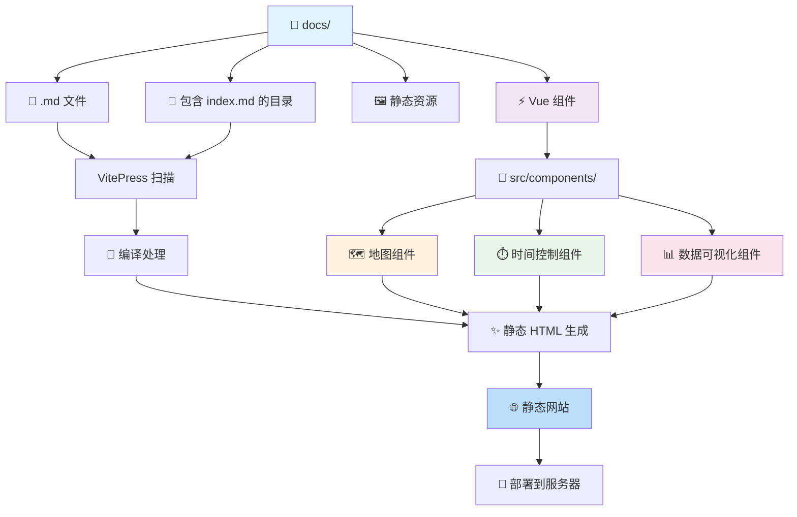

# HkeBUS

## 1. 前置条件
首先需要在电脑上安装 nodejs(22及以上版本)，可以在[nodejs官网](https://nodejs.org/)下载并安装。

## 2. 解压压缩包以获得项目的基本结构

解压压缩包后可以得到如下结构。本项目其实是在 vitepress 的基础上进行了一些定制化的开发，所以目录结构和 vitepress 的目录结构类似。在继续之前，建议先了解一下[vitepress](https://vitepress.vuejs.org/)的相关知识。

```
.
├── README.md                 # 项目说明文档
├── data/                     # 数据文件目录
│   ├── cs_gdf.csv           # 地理数据文件
│   ├── flow.csv             # 流量数据
│   ├── index.csv            # 索引数据
│   ├── stations.csv         # 站点信息
│   └── trajectory.json      # 轨迹数据
├── docs/                     # 文档网站根目录
│   ├── News/                # 新闻动态
│   ├── map/                 # 地图相关页面
│   │   ├── A.md            # 地图A页面
│   │   ├── B.md            # 地图B页面  
│   │   ├── C.md            # 地图C页面
│   │   ├── index.md        # 地图首页
│   │   └── menu.js         # 地图菜单配置
│   ├── public/             # 静态资源目录
│   ├── src/                # 源码目录
│   │   ├── components/     # Vue组件
│   │   │   ├── Dropdown.vue       # 下拉菜单组件
│   │   │   ├── TimeControl.vue    # 时间控制组件
│   │   │   ├── flowmap.vue        # 流量地图组件
│   │   │   ├── map.vue            # 基础地图组件
│   │   │   └── trajectorymap.vue  # 轨迹地图组件
│   │   ├── composables/    # 组合式函数
│   │   │   ├── color.js           # 颜色配置
│   │   │   ├── stastics.js        # 统计函数
│   │   │   ├── ui-config.js       # UI配置
│   │   │   ├── useDeckOverlay.js  # 地图覆盖层
│   │   │   └── useLayerGroup.js   # 图层管理
│   │   ├── dev/            # 开发测试文件
│   │   │   └── dev1.vue           # 开发测试组件
│   │   ├── loaders/        # 数据加载器
│   │   │   ├── cs_gdf.data.js     # 地理数据加载
│   │   │   ├── flow.data.js       # 流量数据加载
│   │   │   ├── h3-clustering.js   # 地理聚类
│   │   │   └── trips.data.js      # 行程数据加载
│   ├── acknowledgment.md   # 致谢页面
│   ├── contact.md          # 联系页面
│   ├── data.md             # 数据说明
│   ├── dev.md              # 开发文档
│   ├── index.md            # 网站首页
│   ├── publications.md     # 出版物页面
│   └── team.md             # 团队介绍
├── favicon.ico             # 网站图标
├── index.html              # 入口HTML文件
└── package.json            # 项目配置依赖
```

简单而言，vitepress 会扫描docs目录下的所有.md文件，以及带有index.md的目录，然后将这些文件编译成静态的html文件，最终生成一个静态网站。所以，我们的网站其实就是由这些.md文件组成的。此外，它支持 Vue 组件嵌入到.md文件中，因此在 `src` 文件夹中，我编写了一些 Vue 组件，主要是地图相关的组件。




## 3. 安装依赖并运行
> 操作的命令行必须要在当前项目的根目录下运行

```bash
cd HkeBUS   # 进入项目根目录 若已进入可忽略
npm install  # 安装项目依赖
```

```bash
npm run docs:dev  # 启动本地开发服务器
# 访问 http://localhost:5173  查看效果
```

## 4. 如何尝试更改地图数据或地图可视化效果
本项目的所有用到的数据文件都放在 `data` 目录下，并使用 vitepress 的静态资源处理机制进行加载。参考文档：[构建时数据加载](https://vitepress.dev/zh/guide/data-loading)

地图可以分为两部分：数据加载和数据可视化。数据加载的代码放在 `docs/src/loaders` 目录下，数据可视化的代码放在 `docs/src/components` 目录下。这两部分在 `docs/map` 目录下的各个.md文件中整合为一个完整的地图页面。