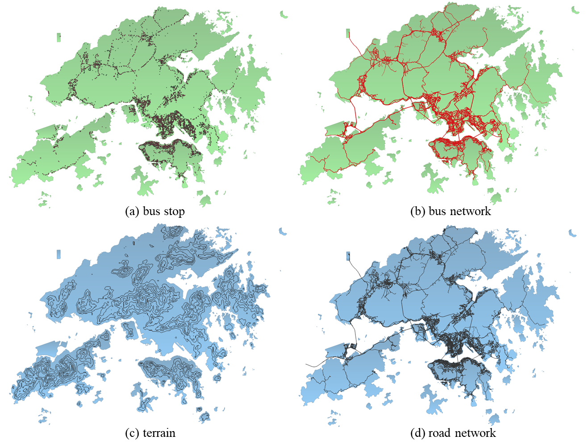

# Data Release: Hong Kong eBus Dataset

> Figure 1: The main dataset of Hong Kong eBus

We are pleased to announce that the dataset from our Hong Kong eBus research is now available online. This dataset comprises official, open-source data from Hong Kong's government databases, offering detailed insights into the bus network in Hong Kong.

The dataset includes both static and dynamic information related to bus system. The static data covers basic information such as routes and fares of public transport services. The dynamic data includes the Estimated Time of Arrival (ETA) for various bus operators.

In addition to bus network data, the dataset also includes other spatial data relevant to transport planning and analysis. This comprises the road network data, tertiary planning units, and a Digital Terrain Model (DTM) of Hong Kong.

We encourage interested users to explore the dataset, which can be accessed through the [data section](/data) on our website. We hope that this data will facilitate your further research and contribute to more sustainable public transportation in Hong Kong.

