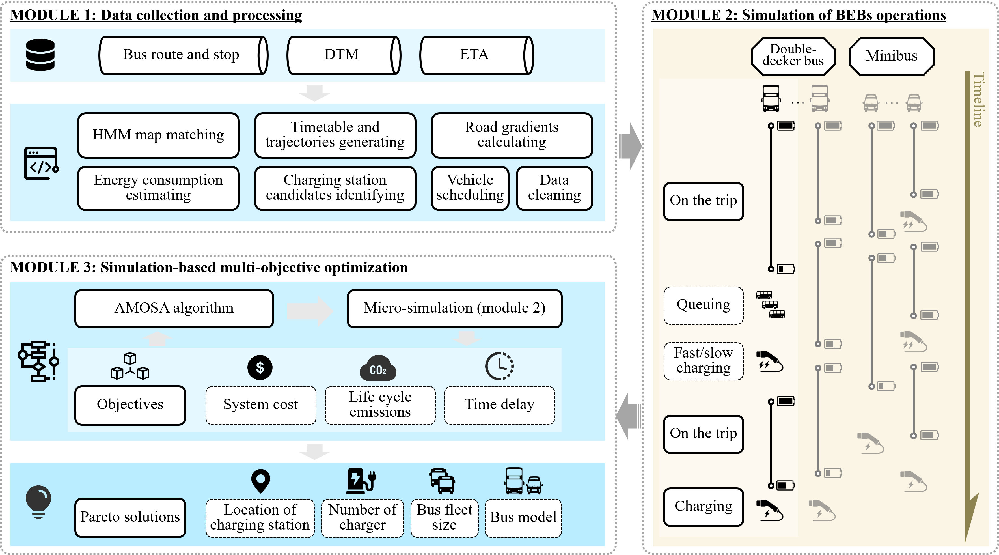

# A Data-Driven Microsimulation-Based Optimization Model was developed for Electric Bus Systems in Hong Kong

> Figure 1: Heatmap of bus stop

As Hong Kong accelerates its ambitious efforts to electrify its bus fleet, we are excited to unveil an  electric bus simulation model designed specifically for the city. Leveraging real-time bus arrival data, our team has reconstructed detailed full-day vehicle trajectories for Hong Kong’s bus network and accurately simulated the driving and charging behaviors of electric buses.

To tackle the complexities of large-scale bus electrification, we have integrated the microsimulation module into a multi-objective optimization framework. This innovative approach empowers us to devise practical and efficient solutions for Hong Kong’s electrification strategy. Key aspects addressed include the selection of electric bus models, determination of procurement quantities, and the optimal planning of charging infrastructure, etc.

Given Hong Kong’s challenging and varied terrain, we have further refined the simulation’s accuracy by incorporating gradient considerations. Our results highlight the critical role of terrain in shaping electrification schemes, demonstrating that accounting for gradients has a substantial and undeniable impact on the overall strategy.

This study marks a step forward in supporting Hong Kong’s transition to a sustainable, electrified public transportation system.

> Figure 2: Distribution of charging stations by capacity